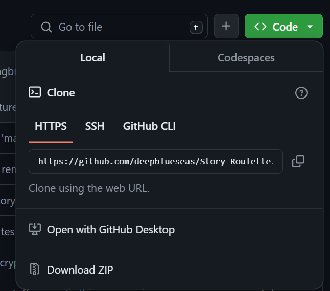

# Story Roulette 

## Description: 
Story Roulette is a application that shows our comprehension of our full stack knowledge. Story Roulette lets you sign up for an account, write short stories based on prompts provided and post them for the other users to read. 

## Installation
To install this repo, simply copy the repo and use git clone in your command line along with the copied repo url with your preferred method.

## Usage 
Start by signing up by clicking "Create New Account."

Fill in your information, and click "Create Account."

You will then be logged into the homepage where you can read currently uploaded stories or you can click "Tell a Story" to start your own story.

When you're ready to start writing press play and follow the prompts!

## License 
MIT 

## Tests 
Please create your own profile and contribute to the story telling. 

## Questions 
You can access our githubs here: https://github.com/deepblueseas | https://github.com/JohnTD796 | https://github.com/domdecap | https://github.com/GarrettBritton for any additional questions. 